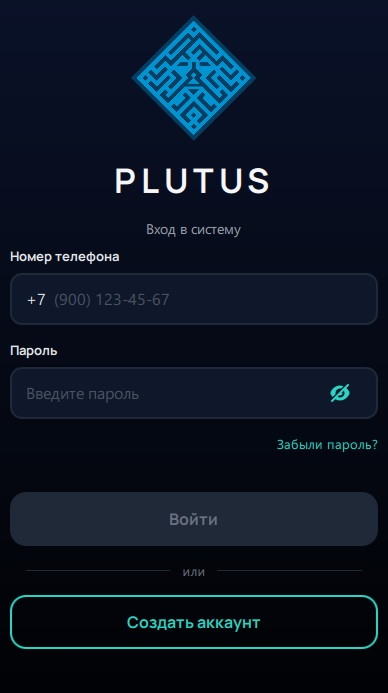
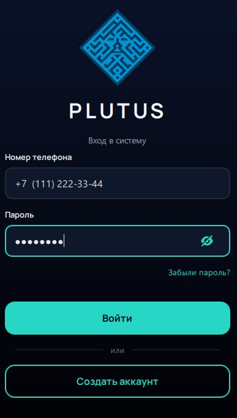
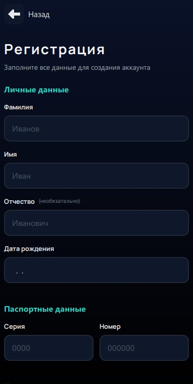
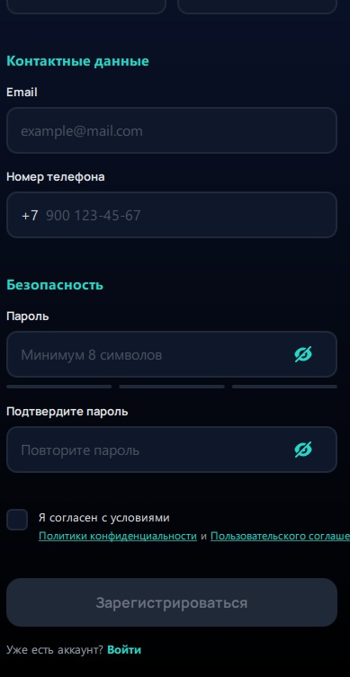
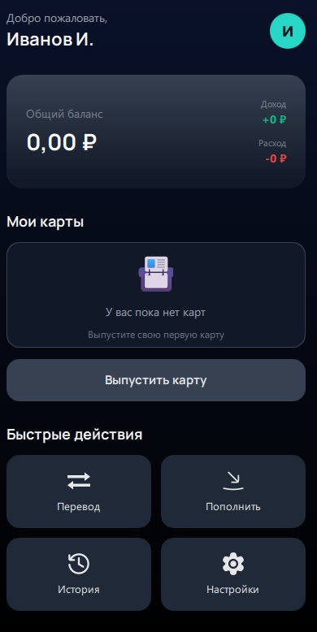
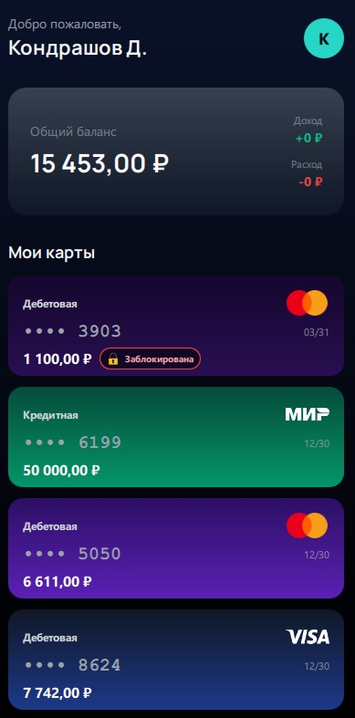
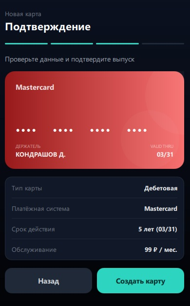
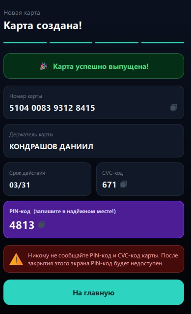
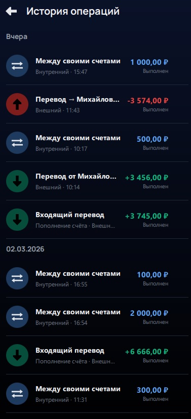
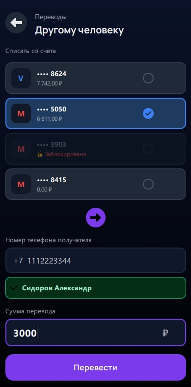

<div align="center">

# PlutusBank

### Финансовая песочница для безопасного обучения банкингу

[](https://www.qt.io/)
[](https://isocpp.org/)
[](https://doc.qt.io/qt-6/qtqml-index.html)
[](https://www.postgresql.org/)
[](LICENSE)
[]()

---

**PlutusBank** — мобильное банковское приложение-тренажёр, в котором можно безопасно освоить управление финансами: от выпуска карт и переводов до кредитов и вложений — без риска потерять реальные деньги.

*Дипломный проект*

</div>

---

## О проекте

В школах не учат управлять деньгами. Люди впервые открывают банковское приложение — и сталкиваются с кредитами, переводами, депозитами, комиссиями, блокировками карт. Цена ошибки — реальные финансовые потери.

**PlutusBank** решает эту проблему. Это мост между незнанием и реальным банкингом: полноценный симулятор, где каждая операция выглядит и работает как в настоящем банке, но выполняется в безопасной «песочнице» с виртуальными средствами.

**Чему учит PlutusBank:**

- Открывать и управлять дебетовыми и кредитными картами
- Выполнять переводы между своими счетами и другим пользователям
- Пополнять баланс и отслеживать историю транзакций
- Понимать, что такое заморозка и блокировка карты
- Ориентироваться в интерфейсе современного банковского приложения
- В перспективе — работать с депозитами, кредитами, криптовалютами и инвестициями

---

## Технологический стек

| Слой | Технология | Назначение |
|------|-----------|------------|
| **Язык** | C++17 | Бизнес-логика, контроллеры, работа с данными |
| **UI-фреймворк** | Qt 6.10 + QML | Декларативный интерфейс с анимациями |
| **Сборка** | CMake 3.21+ | Кросс-платформенная сборка (Windows / Android) |
| **СУБД** | PostgreSQL 18 | Хранение пользователей, карт, транзакций |
| **Архитектура** | MVC | Контроллеры (C++) + Представления (QML) через Q_PROPERTY / Q_INVOKABLE |
| **Платформы** | Android 9+ (API 28), Windows | Мобильная и десктопная сборки |
| **Шрифты** | Manrope | Современная типографика |

---

## Скриншоты

<details>
	<summary>
		<b>Развернуть скриншоты приложения</b>
	</summary>
<br>

<div align="center">

| | |
|:---:|:---:|
|  |  |
|  |  |
|  |  |
|  |  |
|  |  |

И многое другое...
</div>

</details>

---

## Roadmap

### Реализовано

- [x] Регистрация и авторизация пользователей (SHA-256 хэширование паролей)
- [x] Главная страница с отображением баланса и списка карт
- [x] Выпуск дебетовых и кредитных карт (Visa, Mastercard, МИР)
- [x] Детальная страница карты с реквизитами
- [x] Пополнение счёта
- [x] Переводы между своими счетами
- [x] Переводы другим пользователям по номеру телефона
- [x] История транзакций с группировкой по датам
- [x] Заморозка и блокировка карт
- [x] Тёмная тема с градиентным дизайном
- [x] Кросс-платформенная сборка (Android + Windows)
- [x] PostgreSQL-бэкенд с серверной частью

### В планах

- [ ] Оплата услуг и товаров (симуляция покупок)
- [ ] Кредитный модуль (оформление, графики платежей, процентные ставки)
- [ ] Депозиты и накопительные счета (начисление процентов)
- [ ] Криптовалютный модуль (покупка/продажа виртуальных активов)
- [ ] Инвестиционный портфель (акции, облигации, ETF)
- [ ] Обучающие сценарии и подсказки для новичков
- [ ] Push-уведомления о транзакциях
- [ ] Система достижений за освоение финансовых инструментов
- [ ] Аналитика расходов с графиками и категориями
- [ ] Мультивалютные счета и конвертация
- [ ] Экспорт истории операций (PDF / CSV)

---

## Архитектура

```

(Основная)

PlutusBank/
├── src/                    # C++ — контроллеры и бизнес-логика
│   ├── main.cpp
│   ├── DatabaseManager.*   # Singleton, работа с PostgreSQL
│   ├── AuthController.*    # Авторизация / регистрация
│   ├── UserSession.*       # Сессия текущего пользователя
│   ├── CardController.*    # Управление картами
│   ├── TransferController.*# Переводы
│   └── HistoryController.* # История транзакций
├── qml/                    # QML — декларативный UI
│   ├── Main.qml            # Корневой StackView-навигатор
│   ├── Auth.qml            # Экран входа
│   ├── Register.qml        # Экран регистрации
│   ├── MainPage.qml        # Главная страница
│   ├── CreateCardDialog.qml# Мастер выпуска карты
│   ├── CardDetailPage.qml  # Детали карты
│   ├── TransferPage.qml    # Переводы
│   ├── TopUpPage.qml       # Пополнение
│   ├── HistoryPage.qml     # История операций
│   └── assets/             # Шрифты, логотип
├── android/                # Android-манифест и конфигурация
└── CMakeLists.txt          # Сборка проекта
```

---

## Быстрый старт

**Зависимости:** Qt 6.10, CMake 3.21+, PostgreSQL 18

[Гайд по установке](guide/GUIDE.md)

---

## Лицензия

Проект распространяется под лицензией [MIT](LICENSE).

Вы можете свободно использовать, модифицировать и распространять код при сохранении текста лицензии.